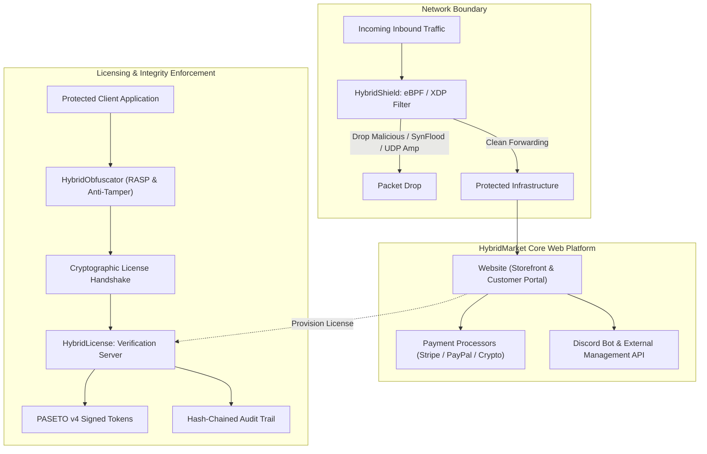

# HYBRIDMARKET

**High-Performance Software Distribution, Cryptographic Licensing, and Kernel-Level Security Infrastructure**

[Platform Overview](#platform-overview) &bull; [Core Ecosystem](#core-ecosystem) &bull; [System Architecture](#system-architecture) &bull; [Technical Pillars](#technical-pillars) &bull; [Security Policy](#security--disclosure)

---

## Platform Overview

HybridMarket designs and maintains an integrated, high-reliability software distribution ecosystem. The platform unifies end-to-end digital commerce, automated cryptographic license management, hardware-locked client verification, low-latency edge packet filtering, and runtime application self-protection.

Every component is engineered for zero-trust environments, deterministic execution, and mission-critical production workloads.

---

## Core Ecosystem

| Repository | Domain | Core Stack | Function & Key Capabilities |
| :--- | :--- | :--- | :--- |
| [**Website**](https://github.com/HybridMarket-ORG/Website) | Commercial Platform & Portal | PHP 8.4, Laravel 13, Vue 3, Inertia.js | Digital storefront, customer management dashboard, multi-gateway billing (Stripe, PayPal, Crypto), automated fulfillment, and Discord Bot integration API. |
| [**HybridLicense**](https://github.com/HybridMarket-ORG/HybridLicense) | Licensing Engine & Auditing | Go, TypeScript, PostgreSQL | High-throughput license server delivering signed PASETO v4 tokens, multi-platform HWID locking, IP enforcement, and hash-chained audit verification. |
| [**HybridShield**](https://github.com/HybridMarket-ORG/HybridShield) | Network Edge & Packet Defense | C, Go, Linux eBPF/XDP | High-performance enterprise DDoS mitigation engine and kernel packet filter operating via native XDP hooks and AF_XDP zero-copy socket buffers. |
| [**HybridObfuscator**](https://github.com/HybridMarket-ORG/HybridObfuscator) | Code Protection & RASP | Go, Python, React | Multi-target binary and bytecode obfuscator with RASP runtime anti-tamper, debugger traps, integrity guards, and SOC telemetry monitoring. |

---

## System Architecture

The following diagram illustrates how the core HybridMarket systems interconnect to provide secure distribution, network mitigation, and client verification:

---

## Technical Pillars

### 1. Cryptographic Trust & Device Binding
- **PASETO v4 Signed Tokens**: Modern public-key cryptography (Ed25519) ensuring tamper-proof client authorization without token malleability.
- **Hardware Profile Hashing (HWID)**: Multi-attribute hardware fingerprinting (CPU ID, motherboard UUID, disk serials, MAC addresses) providing deterministic machine binding.
- **Hash-Chained Audit Trail**: Cryptographically linked transaction and validation history preventing state manipulation.

### 2. High-Throughput Edge Defense
- **Kernel-Level eBPF/XDP**: Direct execution inside the Linux network driver path before socket allocation or memory buffering.
- **AF_XDP Zero-Copy**: Ultra-low overhead packet inspection capable of filtering millions of packets per second under intense volumetric attacks.
- **Stateful Rate Limiting**: Dynamic IP and subnet connection tracking with immediate hardware blacklist synchronization.

### 3. Application Self-Protection (RASP)
- **Multi-Language Transformations**: Control flow flattening, string encryption, dead code synthesis, and opcode mutation.
- **Runtime Integrity Checks**: Anti-debugging vectors, memory scan detection, environment sanity checks, and automated process termination upon compromise.

### 4. Enterprise Storefront & API Integration
- **Modern Monolithic Agility**: Laravel 13 backend paired with Vue 3 / Inertia.js single-page client interface.
- **Deterministic Billing**: Atomic transaction handling supporting fiat gateways alongside non-custodial crypto payment paths.
- **Secured Webhook & Bot APIs**: Granular API token authorization, HMAC request verification, and audit logging.

---

## Security & Disclosure

Security is fundamental to our development lifecycle. If you discover a potential vulnerability or security issue across any HybridMarket repository or live deployment, please adhere to our coordinated disclosure process:

| Protocol | Contact | Expected SLA |
| :--- | :--- | :--- |
| **Direct Security Contact** | security@hybridmarket.org | Initial acknowledgment within 24 hours |
| **General Architecture Support** | hello@hybridmarket.org | Response within 1-2 business days |

Please refrain from opening public GitHub issues for undisclosed security vulnerabilities.

---

**HybridMarket Organization** &bull; [hybridmarket.org](https://hybridmarket.org)

&copy; 2026 HybridMarket. All rights reserved.

